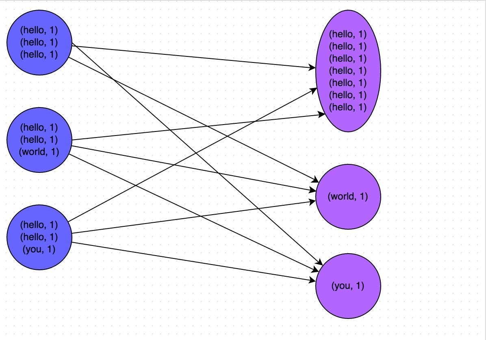
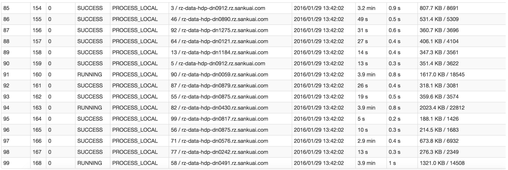

# Spark性能优化指南——高级篇

## 1 数据倾斜调优

### 1.1 调优概述

&emsp;&emsp;有的时候，我们可能会遇到大数据计算中一个最棘手的问题——数据倾斜，此时Spark作业的性能会比期望差很多。数据倾斜调优，就是使用各种技术方案解决不同类型的数据倾斜问题，以保证Spark作业的性能。

### 2.2 数据倾斜发生时的现象

- 绝大多数task执行得都非常快，但个别task执行极慢。比如，总共有1000个task，997个task都在1分钟之内执行完了，但是剩余两三个task却要一两个小时。这种情况很常见。

- 原本能够正常执行的Spark作业，某天突然报出OOM（内存溢出）异常，观察异常栈，是我们写的业务代码造成的。这种情况比较少见。

### 2.3 数据倾斜发生的原理

&emsp;&emsp;数据倾斜的原理很简单：在进行shuffle的时候，必须将各个节点上相同的key拉取到某个节点上的一个task来进行处理，比如按照key进行聚合或join等操作。此时如果某个key对应的数据量特别大的话，就会发生数据倾斜。比如大部分key对应10条数据，但是个别key却对应了100万条数据，那么大部分task可能就只会分配到10条数据，然后1秒钟就运行完了；但是个别task可能分配到了100万数据，要运行一两个小时。因此，整个Spark作业的运行进度是由运行时间最长的那个task决定的。

&emsp;&emsp;因此出现数据倾斜的时候，Spark作业看起来会运行得非常缓慢，甚至可能因为某个task处理的数据量过大导致内存溢出。

&emsp;&emsp;下图就是一个很清晰的例子：hello这个key，在三个节点上对应了总共7条数据，这些数据都会被拉取到同一个task中进行处理；而world和you这两个key分别才对应1条数据，所以另外两个task只要分别处理1条数据即可。此时第一个task的运行时间可能是另外两个task的7倍，而整个stage的运行速度也由运行最慢的那个task所决定。

<div  align="center"></div><br><br/>

### 2.4 如何定位导致数据倾斜的代码

&emsp;&emsp; 数据倾斜只会发生在shuffle过程中。这里给大家罗列一些常用的并且可能会触发shuffle操作的算子：distinct、groupByKey、reduceByKey、aggregateByKey、join、cogroup、repartition等。出现数据倾斜时，可能就是你的代码中使用了这些算子中的某一个所导致的。

#### 某个task执行特别慢的情况

&emsp;&emsp;首先要看的，就是数据倾斜发生在第几个stage中。

&emsp;&emsp;如果是用yarn-client模式提交，那么本地是直接可以看到log的，可以在log中找到当前运行到了第几个stage；如果是用yarn-cluster模式提交，则可以通过Spark Web UI来查看当前运行到了第几个stage。此外，无论是使用yarn-client模式还是yarn-cluster模式，我们都可以在Spark Web UI上深入看一下当前这个stage各个task分配的数据量，从而进一步确定是不是task分配的数据不均匀导致了数据倾斜。

&emsp;&emsp;比如下图中，倒数第三列显示了每个task的运行时间。明显可以看到，有的task运行特别快，只需要几秒钟就可以运行完；而有的task运行特别慢，需要几分钟才能运行完，此时单从运行时间上看就已经能够确定发生数据倾斜了。此外，倒数第一列显示了每个task处理的数据量，明显可以看到，运行时间特别短的task只需要处理几百KB的数据即可，而运行时间特别长的task需要处理几千KB的数据，处理的数据量差了10倍。此时更加能够确定是发生了数据倾斜。

<div  align="center"></div><br><br/>

&emsp;&emsp;知道数据倾斜发生在哪一个stage之后，接着我们就需要根据stage划分原理，推算出来发生倾斜的那个stage对应代码中的哪一部分，这部分代码中肯定会有一个shuffle类算子。精准推算stage与代码的对应关系，需要对Spark的源码有深入的理解，这里我们可以介绍一个相对简单实用的推算方法：只要看到Spark代码中出现了一个shuffle类算子或者是Spark SQL的SQL语句中出现了会导致shuffle的语句（比如group by语句），那么就可以判定，以那个地方为界限划分出了前后两个stage。

&emsp;&emsp;这里我们就以Spark最基础的入门程序——单词计数来举例，如何用最简单的方法大致推算出一个stage对应的代码。如下示例，在整个代码中，只有一个reduceByKey是会发生shuffle的算子，因此就可以认为，以这个算子为界限，会划分出前后两个stage。

- stage0，主要是执行从textFile到map操作，以及执行shuffle write操作。shuffle write操作，我们可以简单理解为对pairs RDD中的数据进行分区操作，每个task处理的数据中，相同的key会写入同一个磁盘文件内。

- stage1，主要是执行从reduceByKey到collect操作，stage1的各个task一开始运行，就会首先执行shuffle read操作。执行shuffle read操作的task，会从stage0的各个task所在节点拉取属于自己处理的那些key，然后对同一个key进行全局性的聚合或join等操作，在这里就是对key的value值进行累加。stage1在执行完reduceByKey算子之后，就计算出了最终的wordCounts RDD，然后会执行collect算子，将所有数据拉取到Driver上，供我们遍历和打印输出。

```scala
val conf = new SparkConf()
val sc = new SparkContext(conf)

val lines = sc.textFile("hdfs://...")
val words = lines.flatMap(_.split(" "))
val pairs = words.map((_, 1))
val wordCounts = pairs.reduceByKey(_ + _)

wordCounts.collect().foreach(println(_))
```
&emsp;&emsp;通过对单词计数程序的分析，希望能够让大家了解最基本的stage划分的原理，以及stage划分后shuffle操作是如何在两个stage的边界处执行的。然后我们就知道如何快速定位出发生数据倾斜的stage对应代码的哪一个部分了。比如我们在Spark Web UI或者本地log中发现，stage1的某几个task执行得特别慢，判定stage1出现了数据倾斜，那么就可以回到代码中定位出stage1主要包括了reduceByKey这个shuffle类算子，此时基本就可以确定是由educeByKey算子导致的数据倾斜问题。比如某个单词出现了100万次，其他单词才出现10次，那么stage1的某个task就要处理100万数据，整个stage的速度就会被这个task拖慢。

#### 某个task莫名其妙内存溢出的情况

&emsp;&emsp;这种情况下去定位出问题的代码就比较容易了。我们建议直接看yarn-client模式下本地log的异常栈，或者是通过YARN查看yarn-cluster模式下的log中的异常栈。一般来说，通过异常栈信息就可以定位到你的代码中哪一行发生了内存溢出。然后在那行代码附近找找，一般也会有shuffle类算子，此时很可能就是这个算子导致了数据倾斜。

&emsp;&emsp;但是大家要注意的是，不能单纯靠偶然的内存溢出就判定发生了数据倾斜。因为自己编写的代码的bug，以及偶然出现的数据异常，也可能会导致内存溢出。因此还是要按照上面所讲的方法，通过Spark Web UI查看报错的那个stage的各个task的运行时间以及分配的数据量，才能确定是否是由于数据倾斜才导致了这次内存溢出。

### 2.5 查看导致数据倾斜的key的数据分布情况

&emsp;&emsp;知道了数据倾斜发生在哪里之后，通常需要分析一下那个执行了shuffle操作并且导致了数据倾斜的RDD/Hive表，查看一下其中key的分布情况。这主要是为之后选择哪一种技术方案提供依据。针对不同的key分布与不同的shuffle算子组合起来的各种情况，可能需要选择不同的技术方案来解决。

&emsp;&emsp;此时根据你执行操作的情况不同，可以有很多种查看key分布的方式：

- 如果是Spark SQL中的group by、join语句导致的数据倾斜，那么就查询一下SQL中使用的表的key分布情况。

- 如果是对Spark RDD执行shuffle算子导致的数据倾斜，那么可以在Spark作业中加入查看key分布的代码，比如RDD.countByKey()。然后对统计出来的各个key出现的次数，collect/take到客户端打印一下，就可以看到key的分布情况。

&emsp;&emsp;举例来说，对于上面所说的单词计数程序，如果确定了是stage1的reduceByKey算子导致了数据倾斜，那么就应该看看进行reduceByKey操作的RDD中的key分布情况，在这个例子中指的就是pairs RDD。如下示例，我们可以先对pairs采样10%的样本数据，然后使用countByKey算子统计出每个key出现的次数，最后在客户端遍历和打印样本数据中各个key的出现次数。

```scala
val sampledPairs = pairs.sample(false, 0.1)
val sampledWordCounts = sampledPairs.countByKey()
sampledWordCounts.foreach(println(_))
```

### 2.6 数据倾斜的解决方案

#### 解决方案一：使用Hive ETL预处理数据

&emsp;&emsp;**方案适用场景**：导致数据倾斜的是Hive表。如果该Hive表中的数据本身很不均匀（比如某个key对应了100万数据，其他key才对应了10条数据），而且业务场景需要频繁使用Spark对Hive表执行某个分析操作，那么比较适合使用这种技术方案。

&emsp;&emsp;**方案实现思路**：此时可以评估一下，是否可以通过Hive来进行数据预处理（即通过Hive ETL预先对数据按照key进行聚合，或者是预先和其他表进行join），然后在Spark作业中针对的数据源就不是原来的Hive表了，而是预处理后的Hive表。此时由于数据已经预先进行过聚合或join操作了，那么在Spark作业中也就不需要使用原先的shuffle类算子执行这类操作了。

&emsp;&emsp;**方案实现原理**：这种方案从根源上解决了数据倾斜，因为彻底避免了在Spark中执行shuffle类算子，那么肯定就不会有数据倾斜的问题了。但是这里也要提醒一下大家，这种方式属于治标不治本。因为毕竟数据本身就存在分布不均匀的问题，所以Hive ETL中进行group by或者join等shuffle操作时，还是会出现数据倾斜，导致Hive ETL的速度很慢。我们只是把数据倾斜的发生提前到了Hive ETL中，避免Spark程序发生数据倾斜而已。

&emsp;&emsp;**方案优点**：实现起来简单便捷，效果还非常好，完全规避掉了数据倾斜，Spark作业的性能会大幅度提升。

&emsp;&emsp;**方案缺点**：治标不治本，Hive ETL中还是会发生数据倾斜。

&emsp;&emsp;**方案实践经验**：在一些Java系统与Spark结合使用的项目中，会出现Java代码频繁调用Spark作业的场景，而且对Spark作业的执行性能要求很高，就比较适合使用这种方案。将数据倾斜提前到上游的Hive ETL，每天仅执行一次，只有那一次是比较慢的，而之后每次Java调用Spark作业时，执行速度都会很快，能够提供更好的用户体验。

&emsp;&emsp;**项目实践经验**：在美团·点评的交互式用户行为分析系统中使用了这种方案，该系统主要是允许用户通过Java Web系统提交数据分析统计任务，后端通过Java提交Spark作业进行数据分析统计。要求Spark作业速度必须要快，尽量在10分钟以内，否则速度太慢，用户体验会很差。所以我们将有些Spark作业的shuffle操作提前到了Hive ETL中，从而让Spark直接使用预处理的Hive中间表，尽可能地减少Spark的shuffle操作，大幅度提升了性能，将部分作业的性能提升了6倍以上。